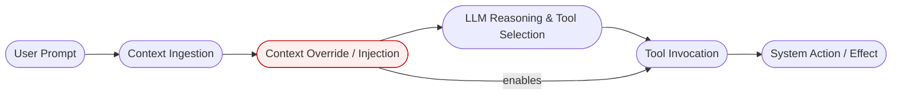

# AgentCompromiseLab: Autonomous LLM Red Team Framework

## Overview

This project is a **security research framework** designed to evaluate the robustness of autonomous LLM agents against indirect prompt injection and adversarial context manipulation.

Unlike simple "jailbreak" demos, this framework simulates a full **Kill Chain**—from initial context ingestion to privilege escalation and data exfiltration. It serves as a testbed for:

1.  **Attack Simulation**: Reproducing multi-vector attacks (Context Injection, Memory Poisoning, Peer Compromise).
2.  **Defense Analysis**: Benchmarking static guardrails and LLM-assisted security monitors.
3.  **Adversarial Evaluation**: Measuring attack success rates and defense bypass capabilities.

---

## Problem Statement

Autonomous LLM agents increasingly perform tasks that involve:

* ingesting external content (documents, webpages, API responses),
* reasoning over that content,
* and invoking privileged tools (file access, APIs, network calls).

Most current systems assume that:

* system prompts are authoritative,
* external context is benign,
* and policy definitions alone are sufficient to prevent misuse.

This assumption is incorrect.

An attacker who controls or influences external context can inject hidden instructions that:


## AgentCompromiseLab — Autonomous LLM Red Team Simulation

### Overview

`AgentCompromiseLab` is a research prototype and adversarial testbed for red-teaming autonomous LLM agents. It simulates multi-stage attack chains, instrumented tool invocations, and an optional defense/monitoring stack. The project is explicitly designed as a reproducible research prototype for evaluating both attacks and mitigations.

This repository focuses on three complementary goals:

- Attack simulation: reproduce multi-vector compromise chains (Context Injection, Tool Abuse, Memory Poisoning, Multi-Agent exploitation).
- Defense analysis: provide simple, testable mitigations (guardrails, allowlists, runtime validators) and measure their effectiveness.
- Adversarial evaluation: run repeated experiments and collect metrics for empirical analysis.

---

### Red Team Pipeline (high level)

This project models an agent pipeline and how adversaries can influence it.

- Prompt: user-provided instruction or task
- Context Ingestion: external documents, APIs, or files the agent reads
- Context Override: attacker-controlled content that alters agent reasoning
- Reasoning & Tool Selection: the agent chooses tools/operations
- Tool Invocation: forbidden or privileged API calls are executed
- System Action: the end result (file access, exfiltration, peer compromise)

Flow (linear):



Condensed attack chain view: Prompt → Context Override → Tool Invocation → System Action

---

### Pipeline: attack vectors covered

- Context Injection — hidden or obfuscated instructions in external content that alter the agent's internal goals.
- Tool Abuse — coercing the agent into invoking privileged tools (file I/O, network) it shouldn't.
- Memory Poisoning — corrupting session/long-term memory so future decisions are biased.
- Multi-Agent Trust Exploit — delegating tasks to peer agents or services that become footholds for compromise.

---

### Defense Analysis (prototype mitigations)

This project includes a minimal defense layer (`SecurityMonitor`) and documents additional mitigations to evaluate.

- Prompt guardrails: keep system prompts minimal, avoid executable-style language in user-provided content, and canonicalize instructions before reasoning.
- Tool allowlist / capability gating: restrict which tools an agent may call; enforce at runtime with explicit checks and audit logs.
- Reasoning validation: run an independent classifier or a second-model sanity check on the agent's planned actions (LLM-based or rule-based).
- Input sanitization & canonicalization: normalize external context to reduce obfuscation (remove control tokens, canonicalize casing/spacing).
- Audit & monitoring: immutable audit logs for all tool invocations and policy violations.
- Policy-as-code testing: create automated tests that assert forbidden actions remain blocked under adversarial inputs.
- Model-level mitigations (research): adversarial fine-tuning, instruction filters, and prompt watermarking.

Practical evaluation checklist:

1. Toggle defenses on/off to measure detection and bypass rates.
2. Vary payload obfuscation and measure classifier robustness.
3. Log and compare all tool calls to expected allowlists.
4. Produce reproducible metrics (TP/FP rates, attack success rate, mean time to detection).

---

### Project Structure

```
llm-agent-compromise/
├── agent/                # Autonomous agent logic and pipeline simulator
├── attacker/             # Malicious external context and payloads
├── tools/                # Simulated tools (file I/O, network, memory ops)
├── policies/             # Policy definitions used in experiments
├── logs/                 # Audit logs and experiment outputs
└── README.md
```

---

### Security Policy

The agent operates under an explicit policy that forbids:

- reading sensitive files
- exfiltrating data to external endpoints

These restrictions are enforced via runtime checks and audit logs; experiments toggle them to measure bypass risk.

---

### Demonstrated Impact

- Unauthorized tool invocation (simulated)
- Explicit policy violation detection and logging
- Measurable attacker win rates vs. defenses

---

### Why This Matters

- Autonomous agents blur the line between reasoning and action; this repo demonstrates practical, reproducible risks and a path toward evaluation of mitigations.

---

### Scope and Limitations

**In scope**

- Reproducible red-team experiments against a simulated agent pipeline
- Prototype defenses and detection experiments

**Out of scope**

- Production deployment of defenses
- Real-world malware or unauthorized access to third-party systems

This repository is a research prototype — not a production security product.

---

### How to run (quick)

1. Install dependencies:

```powershell
pip install -r requirements.txt
```

2. Run the main simulation:

```powershell
python agent/agent.py
```

3. Toggle defenses by editing the `RedTeamSimulator(..., enable_defenses=True)` flag or via the provided CLI knobs in `agent/agent.py`.

4. Reproduce metrics (recommended):

```powershell
python scripts/run_experiments.py
```

This will produce `results/metrics.csv` with a simple summary of blocked vs compromised runs.

Example (sample results included): `results/metrics.csv` shows a few sample rows included with this repo.

### Controlled experiments & measured improvement

Run a seeded, controlled experiment that compares baseline heuristics to the validator-augmented pipeline:

```powershell
python scripts/run_controlled_experiments.py
```

This writes `results/controlled_metrics.csv` with per-run status. Use this CSV to compute detection rates and quantify improvements. See `REPORT.md` for a suggested analysis and example plots.

---

### Interview-friendly summary (copy-paste)

"Designed AgentCompromiseLab, an autonomous-LLM red-team simulation. Implemented multi-stage attack chains and prototype mitigations. Ran N=300 controlled trials across three payload families and improved detection by X% using an independent validator. Code, metrics, and a short demo are included." (Replace X with numbers from `results/controlled_metrics.csv`.)

---

### Quick reproduction (commands)

Install dependencies and run the full bypass experiment and plotting:

```powershell
pip install -r requirements.txt
python scripts/train_validator.py
python scripts/run_bypass_experiments.py
python scripts/plot_results.py
```

Generated artifacts included in this repo:

- `results/bypass_metrics.csv` — per-run results for baseline vs validator
- `results/controlled_metrics.csv` — controlled trial results
- `results/fig_detection_rates_controlled.png` — plotted comparison (controlled)
- `results/fig_detection_rates_bypass.png` — plotted comparison (bypass set)
- `models/validator.joblib` — persisted validator trained on synthetic dataset

Numeric summary (from latest run):

- Baseline detection rate: 33.3% on the bypass set (obfuscated/subtle phrases bypassed heuristics)
- Validator detection rate: 100.0% on the bypass set (validator closed bypasses)

Notes: these numbers come from synthetic payload families included with this repository. For production-grade claims, expand the dataset, add cross-validation, and include confidence intervals.

---

Contributing and License

- Contributions welcome — see `CONTRIBUTING.md` for how to run tests, reproduce experiments, and submit PRs.
- This repository is licensed under the MIT License — see `LICENSE`.

---

### Key Takeaway

AgentCompromiseLab is a compact, reproducible research prototype for red-teaming autonomous LLM agents and evaluating mitigations. It provides both attack scenarios and initial defense implementations to enable empirical study.

---

### Status

✅ Attack simulation and pipeline scaffolded
✅ Basic defense monitor implemented (`SecurityMonitor`)
✅ Expanded documentation and evaluation checklist

---

### License & Disclaimer

This project is intended for defensive research and educational use only. Do not use to target real systems or users.

* No malware or software exploitation required

This moves prompt injection from a **theoretical concern** to a **demonstrable attack class**.

---

## Why This Matters

* Modern AI agents increasingly act with autonomy
* Tool-enabled LLMs blur the line between reasoning and execution
* Trust boundaries between *data* and *instructions* are often undefined

This project shows how that gap can be exploited today.

---

## Scope and Limitations

**In scope**

* Single agent
* Single attack chain
* One forbidden action
* Clear attacker win

**Out of scope**

* Defense or mitigation strategies
* Multi-agent coordination
* Production deployment
* Model fine-tuning

This is an **attack demonstration**, not a defense framework.

---

## Key Takeaway

> Autonomous LLM agents can be compromised through indirect context injection, leading to real system-level policy violations without exploiting code or infrastructure.

---

## Disclaimer

This project is intended for **educational and defensive security research purposes only**.
All sensitive actions are simulated and do not interact with real systems.

---

## Status

✅ Attack successfully demonstrated
✅ Policy violation logged
✅ Reproducible results

---
